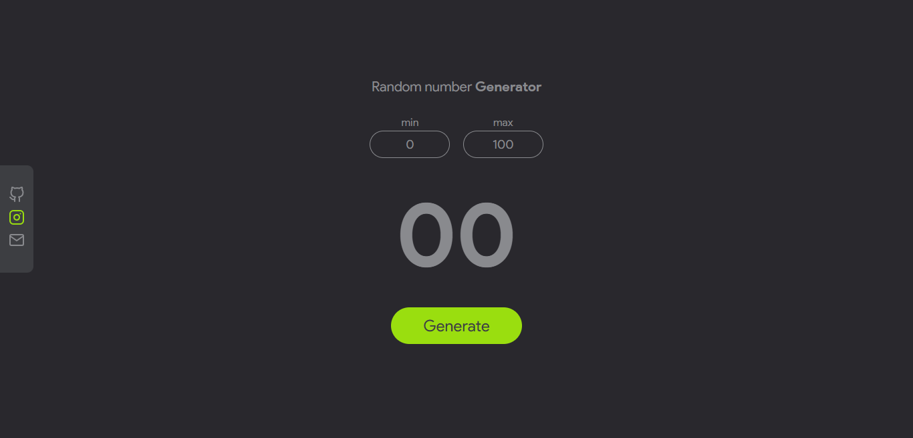

# Random number Generator

This project is a random number generator. The user defined a minimum and a maximum number, then he clicks on the "generate" button. After that the application generate a random number belonging to the user-defined interval. \
The live version in here : [Random number generator - Fanantenana Emmanuel](https://manu3609.github.io/Random-number-generator/)

## Screenshot

## Storytime 😁

I like to lose myself scrolling on Pinterest, and once, I saw designs on scrolling text and numbers. I told myself, it would be fun to code one of them, so I was trying and this project is the result.

## Technologies Used

- HTML5
- CSS3
- JavaScript

## Installation

To install this project, simply clone the Git repository on your local machine.

`git clone https://github.com/Manu3609/Random-number-generator.git`

## Usage

To use the site, open the `index.html` file in your preferred web browser. The site is fully static and does not require a web server to function.

## Features

- Custom form validation with error handling
- Little scroll animation every number generation
